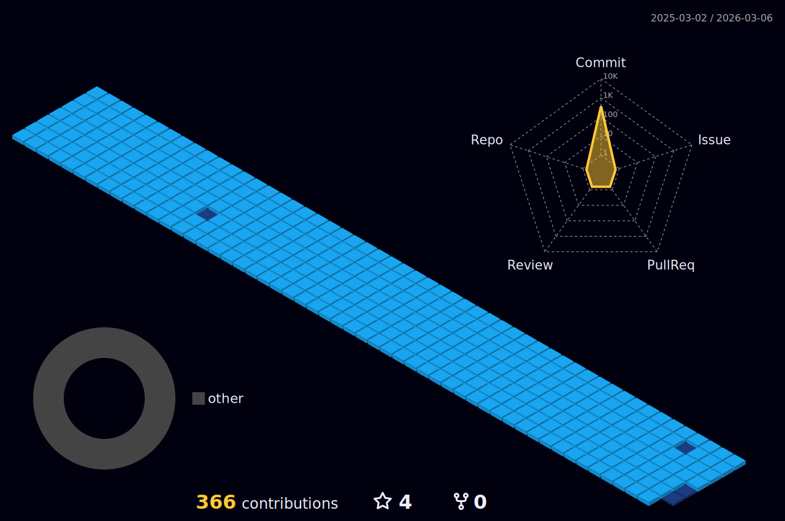
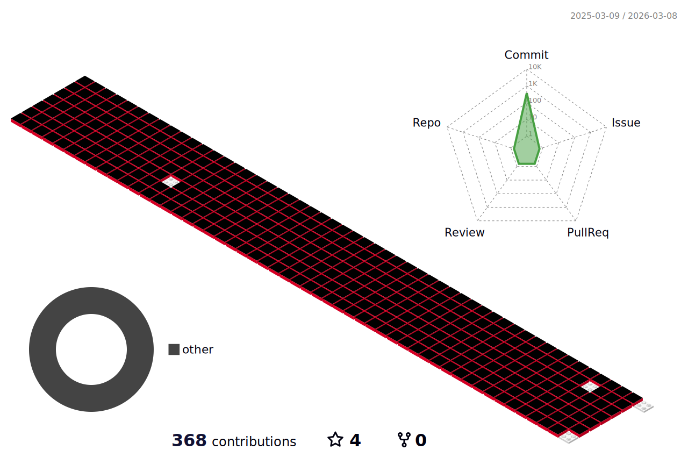
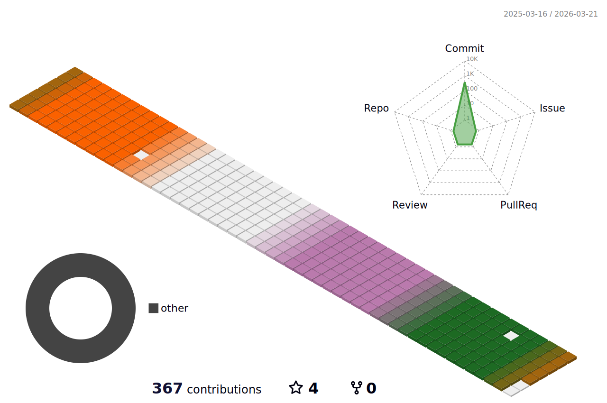

<!-- 헤더 부분 wave

-->

    
<!--달--> 

<!--방문자 수-->

<!--연속 커밋 수-->

### ✏️ Studying ✏️

### 🔍 About Me 🔍

 
 

<!--그래프-->

 

# ✨ Stack ✨

### 👩🏻‍💻 Have used | Frontend 🧑🏻‍💻

 

 

### 🧑🏻‍💻 Have used | Backend 👩🏻‍💻
  
   
  
 

### 📊 Have used | Database 📊
 
 

### 🗃️ Have used | Framework 🗃️
 
 
 
 

### 🛠️ Have used | Development Tools 🛠️
 
 
 
 
 
 
 
   

### ⚒️ Have used | Frontend Tools & Cowork Tools ⚒️
 

 

   
<!--나의 깃 상태-->
<!--

-->

<!-- GITHUB STATS -->
<!--
 
-->

<!--

-->

 

<!--3d 잔디 (https://github.com/yoshi389111/github-profile-3d-contrib#step-4-add-image-to-readmemd) -->
<!---->

<!---->
<!---->

 

<!--푸터-->

